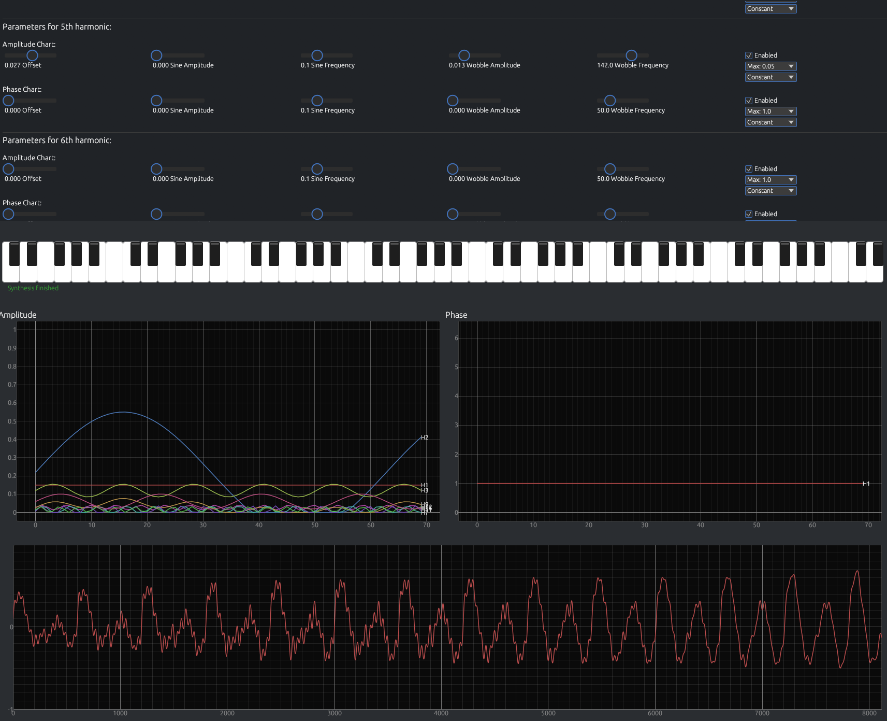

# LeSynth - Fourier

A powerful Fourier synthesizer VST3 audio plugin built in Rust using the nih-plug framework. LeSynth - Fourier generates harmonic sounds through Fourier synthesis with customizable amplitude and phase curves for each harmonic.



Demo MP4 video file can be found in the Assets section of [releases page](https://github.com/hlavnjak/lesynth-fourier/releases/)

## Features

- **64 Harmonics**: Complete control over amplitude and phase for each harmonic with customizable time-varying curves
- **Advanced Curve System & Time-Domain Modulation**: Modify amplitude/time and phase/time curves for each harmonic across buckets/periods using constant and sine curve types, enhanced with Wobble sine component for complex modulation
- **Real-time Visualization**: Interactive plots showing harmonic data and assembled waveforms
- **Piano Keyboard Interface**: Click-to-play virtual piano keyboard
- **Polyphonic Synthesis**: Multiple voice support with automatic gain scaling
- **Cross-Platform**: Works on all platforms supported by nih-plug
- **Real-time Performance**: Optimized audio processing with background computation

## Installation

### Recommended: Use Latest Release

For most users, we recommend downloading the latest pre-built plugin from the [releases page](https://github.com/hlavnjak/lesynth-fourier/releases/). The release notes contain detailed installation instructions for both Linux and Windows platforms.

### Manual Installation (after building)

After building from source, the VST3 plugin will be available in the `target/debug/` or `target/release/` directory. Copy the `.vst3` bundle to your DAW's VST3 plugin directory:

- **Linux**: `~/.vst3/`
- **Windows**: `%COMMONPROGRAMFILES%\VST3\`

## Building

### Debug Build (with logging)
```bash
cargo build --features debug-logging
```

### Release Build
```bash
cargo build --release
```

The debug build includes comprehensive logging to both stdout and a log file (`lesynth.log` in the system temp directory), while the release build is optimized for performance with no logging overhead.

## Technology Stack

- **Language**: Rust
- **Audio Framework**: [nih-plug](https://github.com/robbert-vdh/nih-plug) (currently using forked version with patches)
- **GUI Framework**: egui via nih-plug-egui
- **Plugin Formats**: VST3
- **Visualization**: egui_plot for real-time plotting

## Usage

1. Load LeSynthFourier in your DAW as a VST3 instrument
2. Use the piano keyboard interface or MIDI input to trigger notes
3. Adjust harmonic parameters using the amplitude and phase controls
4. View real-time visualization of harmonic content and assembled waveforms
5. Experiment with different curve types for each harmonic

## Architecture

LeSynth features a modular architecture with clear separation of concerns:

- **Audio Engine**: Real-time synthesis with background buffer computation
- **Parameter System**: Thread-safe parameter management with 64 harmonics, each supporting independent amplitude and phase curve modulation over time
- **Curve Modulation**: Each harmonic's amplitude and phase can be modified across time buckets/periods using:
  - **Constant curves**: Static values with optional Wobble sine modulation
  - **Sine curves**: Sinusoidal modulation with customizable amplitude and frequency, plus Wobble enhancement
  - **Wobble component**: Additional sine-based modulation that can be applied to both curve types for complex harmonic evolution
- **GUI System**: Interactive interface with real-time plotting of time-varying harmonic curves
- **Voice Management**: Polyphonic voice allocation with fade in/out

## Testing Matrix

LeSynth - Fourier has been tested on the following platforms and DAWs:

| Platform | DAW/Host |
|----------|----------|
| Windows  | Reaper 7.56 |
| macOS    | Ableton Live 12 |
| macOS    | Waveform Free 13 |
| Linux    | Reaper 7.56 |
| Linux    | Custom VST Host (dev) |

**Note**: While the plugin should work with other VST3-compatible DAWs, the above combinations have been specifically tested and verified to work correctly.

## Development

### Prerequisites
- Rust (latest stable)
- nih-plug dependencies

**Note**: This project currently uses a [forked version of nih-plug](https://github.com/hlavnjak/nih-plug/) with custom patches for enhanced functionality. The fork includes improvements for host-triggered resizing. 
### Project Structure
```
src/
├── constants.rs        # Global constants and configuration
├── engine/            # Audio processing engine
│   ├── chart_type.rs
│   ├── shared_params.rs
│   └── synth_compute_engine.rs
├── gui/               # User interface components
│   ├── assembled_chart.rs
│   ├── curve_controls.rs
│   ├── harmonic_plot.rs
│   └── piano_keyboard.rs
├── params/            # Parameter definitions
│   ├── curve_type.rs
│   ├── harmonic.rs
│   └── synth_params.rs
├── lib.rs             # Module exports and VST3 registration
├── plugin.rs          # Main plugin implementation
└── voice.rs           # Voice management and processing
```

## License

Licensed under the Apache License, Version 2.0. See the license headers in individual source files for details.

## Author

Copyright 2025 Jakub Hlavnicka

---

*Powered by [nih-plug](https://github.com/robbert-vdh/nih-plug) - A modern, efficient, and easy to use audio plugin framework for Rust.*
